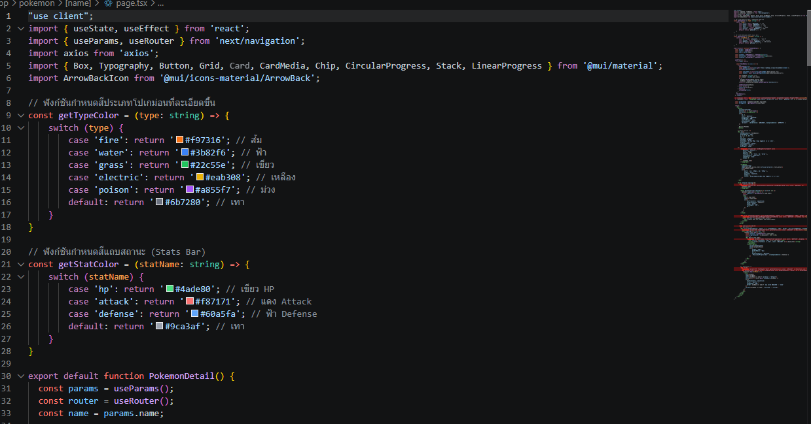
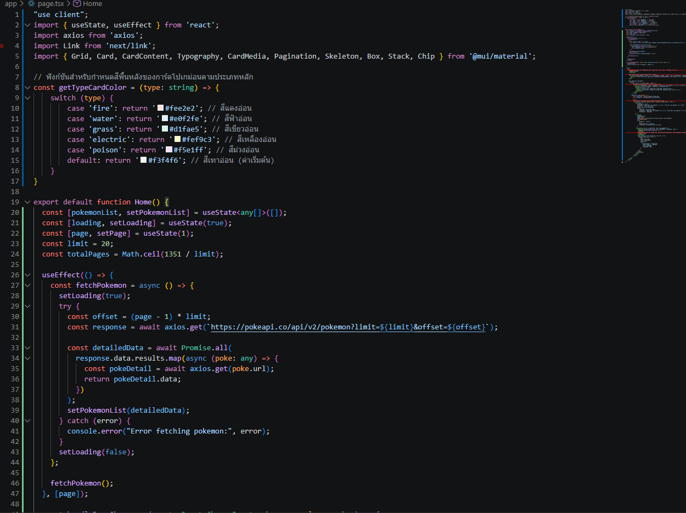
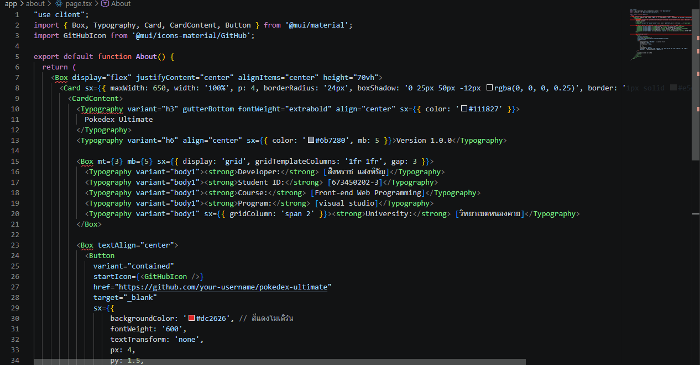

# 🎒 Pokédex Ultimate - Next.js Project

เว็บไซต์ระบบฐานข้อมูลโปเกมอนสุดล้ำ (Pokédex) ที่ดึงข้อมูลแบบ Real-time จาก PokeAPI แสดงผลด้วยดีไซน์ที่ทันสมัย รองรับการใช้งานทุกหน้าจอ (Responsive Design) พัฒนาขึ้นเพื่อส่งเป็นโปรเจกต์ในรายวิชา

## 🌐 ลิงก์เข้าใช้งานเว็บไซต์ (Live Demo)
👉 **Vercel Deployment:** [https://pokedex-ultimate-2nkf.vercel.app]

---

## 👤 ข้อมูลผู้พัฒนา
* **ชื่อ-นามสกุล:** [สิงหราช แสงหิรัญ]
* **รหัสนักศึกษา:** [673450202-3]


---

## ✨ คุณสมบัติเด่นของโปรเจกต์ (Features)
* **Real-time API Integration:** ดึงข้อมูลโปเกมอนทั้งหมด 1,351 ตัวจาก PokeAPI โดยตรง
* **Dynamic Card Background:** สีพื้นหลังของการ์ดโปเกม่อนเปลี่ยนไปตาม "ประเภทหลัก (Type)" ของโปเกมอนตัวนั้นอัตโนมัติ (เช่น ไฟ=สีแดง, น้ำ=สีฟ้า, พืช=สีเขียว)
* **Premium UI/UX:** ใช้ Material UI (MUI) ในการดีไซน์ พร้อมเอฟเฟกต์ Hover, การ์ดแบบมีมิติ และระบบ Skeleton Loader ระหว่างรอโหลดข้อมูล
* **Responsive Pagination:** ระบบเปลี่ยนหน้าเพื่อดูโปเกมอนทีละ 20 ตัว พร้อมระบบเลื่อนหน้าจอกลับขึ้นไปด้านบนสุดอัตโนมัติ
* **Advanced Detail Page:** หน้ารายละเอียดโปเกมอนแสดงรูปภาพขนาดใหญ่, ค่าสถานะพื้นฐาน (Base Stats) เป็นแถบ Linear Progress Bar ดีไซน์สวยงาม
* **Audio Cries System:** สามารถกดฟังเสียงร้องล่าสุดของโปเกมอนแต่ละตัวได้จากหน้ารายละเอียด
* **Interactive Evolution Chain:** แสดงสายวิวัฒนาการของโปเกมอนในรูปแบบปุ่ม Chip ที่สามารถคลิกเพื่อวาร์ปไปดูร่างถัดไปหรือร่างก่อนหน้าได้ทันที

---

## 📸 ภาพตัวอย่างโปรเจกต์ (Screenshots)

### หน้าแรก (Home Page - รายชื่อโปเกมอนทั้งหมด)


### หน้ารายละเอียด (Detail Page - ข้อมูลและแถบสถานะ)


### หน้าเกี่ยวกับผู้พัฒนา (About Page)


---

## 🛠️ เทคโนโลยีที่ใช้ (Tech Stack)
* **Framework:** Next.js (App Router)
* **Language:** TypeScript
* **UI Library:** Material UI (MUI) & Emotion Style
* **API Client:** Axios
* **Icons:** MUI Icons Material

---

## 🚀 วิธีการรันโปรเจกต์ในเครื่อง (Local Development)

1. ติดตั้ง Dependencies ทั้งหมด:
```bash
npm install